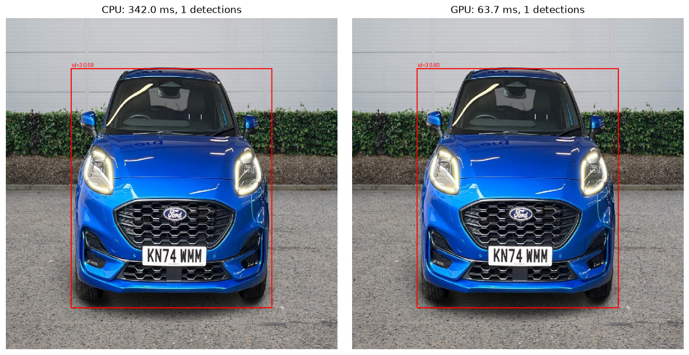
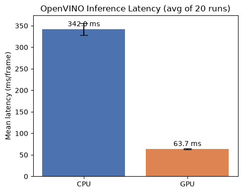
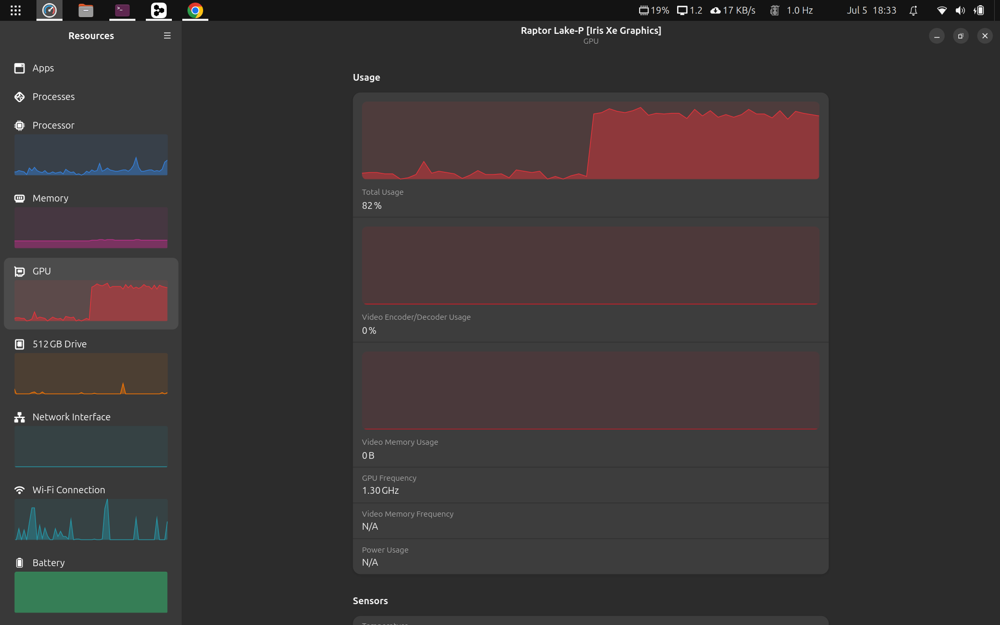

# Intel Iris Xe GPU with OpenVINO

[](https://docs.openvino.ai/)
[](https://www.python.org/)
[](LICENSE)
[](https://ubuntu.com/)

Complete setup and optimization guide for Intel Iris Xe Graphics with OpenVINO on Ubuntu 26.04 LTS. This repository provides production-ready examples for high-performance inference on Intel integrated GPUs.

## 🚀 Quick Start

```bash
git clone https://github.com/micrometre/openvino.git 
cd intel-iris
./setup.sh
source .venv/bin/activate
python openvino/hello_openvino.py
```


## 🎯 Overview

### Visual Showcase



*Object detection in action with Intel Iris Xe GPU acceleration*



*CPU vs GPU performance benchmarking results*



*OpenVINO inference running on Ubuntu 26.04 LTS*

This repository provides a comprehensive toolkit for leveraging Intel Iris Xe Graphics with OpenVINO inference engine. It includes optimized models, example applications, and automated setup scripts specifically designed for Ubuntu 26.04 LTS and Intel Raptor Lake processors.

### Ubuntu 26.04 LTS Optimizations

Ubuntu 26.04 LTS brings significant enhancements for AI development with OpenVINO:

- **Native Driver Support**: OpenVINO is integrated into the Ubuntu archive, eliminating the need for third-party repositories
- **Security & Provenance**: Official Ubuntu packages ensure security updates and verified software sources
- **Hardware Integration**: Seamless support for Intel GPU acceleration with optimized kernel drivers
- **Inference Snaps**: Hassle-free access to silicon-optimized models through Ubuntu's inference snap ecosystem

For more details on Ubuntu's AI development initiatives, see [Developing with AI on Ubuntu](https://discourse.ubuntu.com/t/developing-with-ai-on-ubuntu/75299).

### Key Benefits

- **🔥 Performance**: Up to 4x faster inference with GPU acceleration
- **🛠️ Easy Setup**: One-command installation with all dependencies
- **📦 Production Ready**: Optimized models and error handling
- **🔧 Flexible**: Support for multiple inference backends (CPU, GPU, AUTO)
- **📚 Comprehensive**: Complete examples from Hello World to advanced object detection

## ✨ Features

### Core Capabilities
- **OpenVINO 2024+ Integration**: Latest runtime with optimized inference kernels
- **Intel Iris Xe Support**: Full GPU acceleration for compatible Intel processors
- **Multi-Device Inference**: Seamless switching between CPU, GPU, and automatic device selection
- **Model Zoo Integration**: Pre-configured MobileNet v1/v2 SSD models from Open Model Zoo
- **CPU vs GPU Benchmarking**: Comprehensive performance comparison notebook for device optimization

### Advanced Features
- **TensorFlow Compatibility**: Direct TensorFlow model conversion and inference
- **Image Classification**: ImageNet classification with MobileNet models
- **Object Detection**: Real-time object detection with confidence scoring
- **Performance Monitoring**: Built-in benchmarking and profiling tools
- **Debug Mode**: Comprehensive logging and error reporting

### Development Tools
- **Automated Setup**: Zero-configuration installation scripts
- **Driver Management**: Intel GPU driver installation and verification
- **Virtual Environment**: Isolated Python environment with all dependencies
- **Cleanup Scripts**: Complete uninstallation and system cleanup utilities

## 📊 System Requirements

### Hardware Requirements
- **Processor**: Intel Raptor Lake-P/Iris Xe Graphics or newer
- **Memory**: 4GB RAM minimum (8GB+ recommended for large models)
- **Storage**: 5GB free disk space for models and dependencies
- **Graphics**: Intel integrated GPU with driver support

### Software Requirements
- **Operating System**: Ubuntu 26.04 LTS (tested and verified)
- **Python**: 3.8+ (3.10+ recommended)
- **Git**: For repository cloning and version control
- **Jupyter**: For notebook-based benchmarking (optional, for CPU vs GPU comparison)

### Optional Requirements
- **Docker**: For containerized deployments
- **CUDA**: Not required (Intel GPU acceleration used instead)

## 🔧 Installation

### Option 1: Automated Setup (Recommended)

```bash
# Clone the repository
git clone https://github.com/micrometre/openvino.git intel-iris
cd intel-iris

# Run the automated setup
./setup.sh

# Activate the virtual environment
source .venv/bin/activate
```

The automated setup will:
- ✅ Create Python virtual environment (`.venv/`)
- ✅ Install OpenVINO 2024+ runtime and development tools
- ✅ Configure Intel GPU drivers (if needed)
- ✅ Install Python dependencies from `requirements.txt`
- ✅ Download and configure pre-trained models
- ✅ Set up environment variables and paths

### Option 2: Manual Installation

#### Step 1: Install OpenVINO
```bash
bash scripts/install_openvino.sh
```

#### Step 2: Install GPU Drivers
```bash
bash scripts/install_driver.sh
```

#### Step 3: Setup Python Environment
```bash
python3 -m venv .venv
source .venv/bin/activate
pip install --upgrade pip
pip install -r requirements.txt
```

### Verification

Test your installation with the Hello World example:
```bash
python openvino/hello_openvino.py --debug
```

Expected output should show available devices including GPU.

### Ubuntu 26.04 LTS Specific Notes

On Ubuntu 26.04 LTS, you can leverage the native OpenVINO packages from the Ubuntu archive:

```bash
# On Ubuntu 26.04 LTS, OpenVINO is available directly
sudo apt update
sudo apt install openvino-runtime openvino-dev

# The repository setup scripts will automatically detect and use
# the native packages when available
./setup.sh
```

This provides:
- **Simplified Installation**: No need for external repositories
- **Automatic Security Updates**: Through the standard Ubuntu package management
- **Better Integration**: Optimized for Ubuntu 26.04 kernel and driver stack

## 💡 Usage Examples

### Hello World Example

Basic OpenVINO functionality test:

```bash
python openvino/hello_openvino.py
```

With debug information:
```bash
python openvino/hello_openvino.py --debug
```

### Object Detection

Run object detection on images:

```bash
# Basic usage
python openvino/mobilenetv2_object_detection.py \
  --device GPU \
  --image images/sample.jpg \
  --threshold 0.5

# With all options
python openvino/mobilenetv2_object_detection.py \
  --device AUTO \
  --image images/test.jpg \
  --threshold 0.3 \
  --output results/ \
  --debug \
  --show-confidence
```

### CPU vs GPU Performance Comparison

**⭐ Main Feature**: Comprehensive benchmarking notebook for comparing CPU and GPU inference performance.

```bash
# Install Jupyter if not already installed
pip install jupyter

# Start Jupyter notebook
jupyter notebook openvino/openvino_cpu_vs_gpu_detection.ipynb
```

The notebook provides:
- **Automated Benchmarking**: Runs multiple inference iterations on both CPU and GPU
- **Performance Metrics**: Average time, standard deviation, min/max times, and FPS calculations
- **Speedup Analysis**: Direct comparison showing GPU vs CPU performance gains
- **Detection Verification**: Ensures accuracy consistency between devices
- **Visualization**: Displays detection results with annotated images
- **Configurable Parameters**: Adjustable warmup runs, benchmark iterations, and confidence thresholds

This notebook is essential for:
- Optimizing device selection for your specific hardware
- Understanding performance characteristics of different inference backends
- Validating that GPU acceleration provides meaningful speedup for your use case
- Production deployment planning and resource allocation

#### Command Line Arguments
- `--device`: Target inference device (`CPU`, `GPU`, `AUTO`, `MULTI`)
- `--image`: Path to input image file
- `--threshold`: Detection confidence threshold (0.0-1.0, default: 0.5)
- `--output`: Output directory for results (default: current directory)
- `--debug`: Enable verbose debug output
- `--show-confidence`: Display confidence scores for detections

### Benchmarking with benchmark_app

> **Note:** The system `/usr/bin/benchmark_app` crashes on Ubuntu 26.04 due to a broken
> `python3-openvino-2026.2.1` APT package (missing `AxisSet` symbol in `_pyopenvino.so` for Python 3.14).
> Always use the `.venv` version instead.

```bash
# CPU benchmark
.venv/bin/benchmark_app \
  -m models/public/ssd_mobilenet_v1_fpn_coco/FP16/ssd_mobilenet_v1_fpn_coco.xml \
  -d CPU

# GPU benchmark
.venv/bin/benchmark_app \
  -m models/public/ssd_mobilenet_v1_fpn_coco/FP16/ssd_mobilenet_v1_fpn_coco.xml \
  -d GPU

# Latency-optimised run
.venv/bin/benchmark_app \
  -m models/public/ssd_mobilenet_v1_fpn_coco/FP16/ssd_mobilenet_v1_fpn_coco.xml \
  -d GPU -hint latency -niter 100
```

### TensorFlow Integration

Convert and run TensorFlow models:

```bash
# Convert TensorFlow model to OpenVINO
python openvino/convert_tf_imagenet.py \
  --input-model mobilenet_v2_1.0_224 \
  --output-model mobilenet_v2_ov.xml

# Run inference with converted model
python openvino/classify_tf_imagenet.py \
  --model mobilenet_v2_ov.xml \
  --image images/test.jpg \
  --device GPU
```


## 📁 Project Structure

```
intel-iris/
├── README.md                          # This file
├── LICENSE                            # License information
├── requirements.txt                   # Python dependencies
├── setup.sh                          # Main automated setup script
├── .gitignore                        # Git ignore rules
│
├── scripts/                          # Installation and utility scripts
│   ├── install_openvino.sh           # OpenVINO installation
│   ├── install_driver.sh             # Intel GPU driver setup
│   ├── uninstall_openvino.sh         # OpenVINO cleanup
│   ├── uninstall_driver.sh           # Driver cleanup
│   ├── debug_intel.sh                # Intel GPU / hardware debugging
│   └── debug_openvino.sh             # OpenVINO installation debugging
│
├── openvino/                         # Core OpenVINO examples
│   ├── hello_openvino.py            # Hello World example
│   ├── mobilenetv2_object_detection.py # Object detection demo
│   ├── openvino_cpu_vs_gpu_detection.ipynb # CPU vs GPU benchmarking notebook (⭐ Main Feature)
│   ├── classify_tf_imagenet.py       # TensorFlow image classification
│   ├── convert_tf_imagenet.py        # TensorFlow model conversion
│   └── test_ov.py                    # Testing conversion utilities
│
├── images/                           # Sample images for testing
│   ├── sample.jpg                   # Default test image
│   └── test.jpg                     # Additional test samples
│
├── models/                          # Downloaded model files
│   └── public/                      # Open Model Zoo models
│       ├── ssd_mobilenet_v1_fpn_coco/
│       └── ssdlite_mobilenet_v2/
│
└── .venv/                           # Python virtual environment
```

## ⚡ Performance Optimization

### GPU Optimization

Enable maximum GPU performance:

```bash
# Set environment variables for optimal GPU usage
export OPENVINO_GPU_DEVICE=0
export CL_CONTEXT_COMPILER_MODE_INTELFPGA=1

# Run with GPU device
python openvino/mobilenetv2_object_detection.py --device GPU
```

### Memory Management

Optimize memory usage for large models:

```bash
# Limit memory usage
export OV_GPU_MEMORY_LIMIT=2147483648  # 2GB limit

# Use memory pooling
export OV_GPU_MEMORY_POOL=1
```

### Batch Processing

Process multiple images efficiently:

```bash
# Create a simple batch script
for image in images/*.jpg; do
  python openvino/mobilenetv2_object_detection.py \
    --device GPU \
    --image "$image" \
    --threshold 0.5 \
    --output results/
done
```

## 🔍 Troubleshooting

### Common Issues

#### GPU Not Detected

**Symptoms**: `hello_openvino.py` only shows CPU device

**Solutions**:
```bash
# 1. Check Intel GPU hardware
lspci | grep -i "VGA\|Display\|3D"

# 2. Verify driver installation
lsmod | grep i915

# 3. Check OpenVINO GPU plugin
python -c "from openvino.runtime import Core; print(Core().available_devices)"

# 4. Reinstall drivers if needed
sudo bash scripts/install_driver.sh
```

#### Memory Issues

**Symptoms**: Out of memory errors during inference

**Solutions**:
```bash
# 1. Use CPU instead of GPU for large models
python openvino/mobilenetv2_object_detection.py --device CPU

```

#### Import Errors

**Symptoms**: `ModuleNotFoundError` or `ImportError: cannot import name 'AxisSet'` for OpenVINO packages

**Solutions**:
```bash
# 1. Activate virtual environment
source .venv/bin/activate

# 2. Reinstall dependencies
pip install -r requirements.txt --force-reinstall

# 3. Verify OpenVINO installation
python -c "import openvino; print(openvino.__version__)"

# 4. Check Python path
echo $PYTHONPATH
```

#### benchmark_app Crashes on Launch

**Symptoms**: `ImportError: cannot import name 'AxisSet' from 'openvino._pyopenvino'` / crash report in `/var/crash/`

**Cause**: The `python3-openvino-2026.2.1` APT package has a broken native extension (`_pyopenvino.so`) under Python 3.14. The system `/usr/bin/benchmark_app` uses the system Python and hits this bug.

**Solution**: Use the `.venv` binary which runs openvino 2024.6.0 under Python 3.12:
```bash
.venv/bin/benchmark_app -m <model.xml> -d CPU
```

To diagnose the full installation state:
```bash
bash scripts/debug_openvino.sh
```


### Debug Mode


```bash
# Set debug environment variables
export OV_LOG_LEVEL=DEBUG
export OPENVINO_LOG_LEVEL=DEBUG

# Run with debug flag
python openvino/mobilenetv2_object_detection.py --debug --device GPU
```

### Getting Help

1. **Check Logs**: Always run with `--debug` flag first
2. **Verify Installation**: Run `hello_openvino.py --debug`
3. **OpenVINO Install Diagnostics**: Run `bash scripts/debug_openvino.sh` — checks APT packages, shared libraries, Python module, available devices, key dependencies, and runs a CPU smoke test
4. **GPU / Hardware Diagnostics**: Run `bash scripts/debug_intel.sh` for driver, OpenCL, Level Zero, and device permission checks

## 📚 API Reference

### Core Classes

#### OpenVINO Core
```python
from openvino import Core

core = Core()
devices = core.available_devices
```

#### Model Loading
```python
model = core.read_model("model.xml")
compiled_model = core.compile_model(model, "GPU")
```

### Configuration Options

#### Device Configuration
```python
# GPU configuration
config = {
    "GPU_DEVICE_ID": "0",
    "GPU_MEMORY_LIMIT": "2147483648",
    "PERFORMANCE_HINT": "THROUGHPUT"
}
```

#### Performance Hints
- `LATENCY`: Optimize for single inference speed
- `THROUGHPUT`: Optimize for batch processing
- `CUMULATIVE_THROUGHPUT`: Multi-stream optimization


## 📖 References

### Official Documentation
- [OpenVINO Documentation](https://docs.openvino.ai/)
- [Open Model Zoo](https://github.com/openvinotoolkit/open_model_zoo)
- [Intel GPU Drivers](https://www.intel.com/content/www/us/en/support/products/80939/graphics.html)
- [Developing with AI on Ubuntu](https://discourse.ubuntu.com/t/developing-with-ai-on-ubuntu/75299) - Ubuntu's AI development initiatives and OpenVINO integration

### Performance Guides
- [OpenVINO Performance Guide](https://docs.openvino.ai/latest/openvino_docs_OV_UG_Performance.html)
- [GPU Optimization Guide](https://docs.openvino.ai/latest/openvino_docs_OV_UG_GPU_plugin.html)

### Model Resources
- [MobileNet Models](https://github.com/tensorflow/models/tree/master/research/slim/nets/mobilenet)
- [COCO Dataset](https://cocodataset.org/)
- [ImageNet](http://www.image-net.org/)

## 📄 License

This project is licensed under the MIT License - see the [LICENSE](LICENSE) file for details.

## 🙏 Acknowledgments

- Intel OpenVINO 
- TensorFlow 

---

